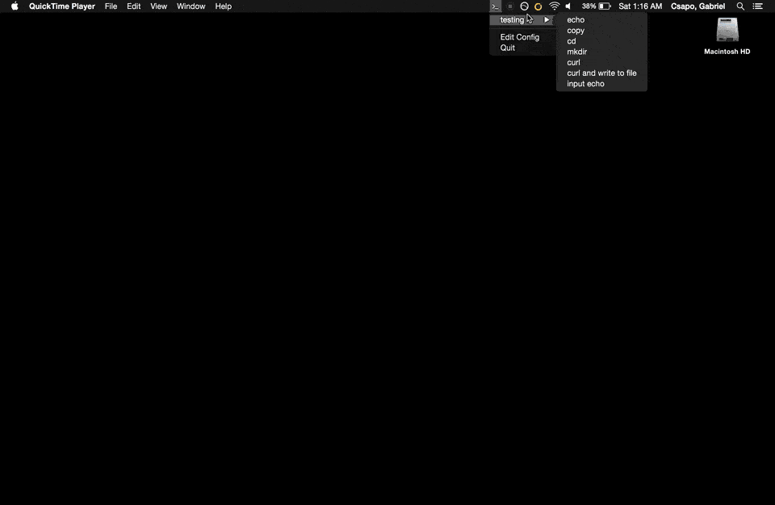

# steno

Running scripts is a breeze when you can run your scripts with other scripts, but don't you hate opening up terminal? 


Steno is a place to put all those scripts in plain site seperated by your own grouping (work, home, garden, etc)

Current features that Steno supports

- Basic Shell Commands
- Basic Shell Commands with Interoperable



# Example Configuration

```
{
  "groups": [
    {
      "name": "testing",
      "commands": [
        {
          "name": "echo",
          "command": "echo \"testing\""
        },
        {
          "name": "copy",
          "command": "echo \"check this out\" | pbcopy"
        },
        {
          "name": "cd",
          "command": "cd;cd Desktop;"
        },
        {
          "name": "mkdir",
          "command": "cd;cd Desktop;mkdir steno;"
        },
        {
          "name": "curl",
          "command": "curl -i www.google.com"
        },
        {
          "name": "curl and write to file",
          "command": "cd;cd Desktop;mkdir steno;cd steno;curl www.google.com > google.html"
        },
        {
          "name": "input echo",
          "command": "echo \"your name is {name}\"",
          "args": {
            "name": "What is your name"
          }
        }
      ]
    }
  ]
}
```